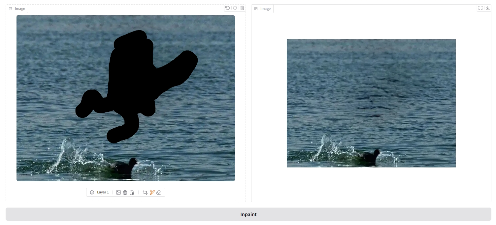
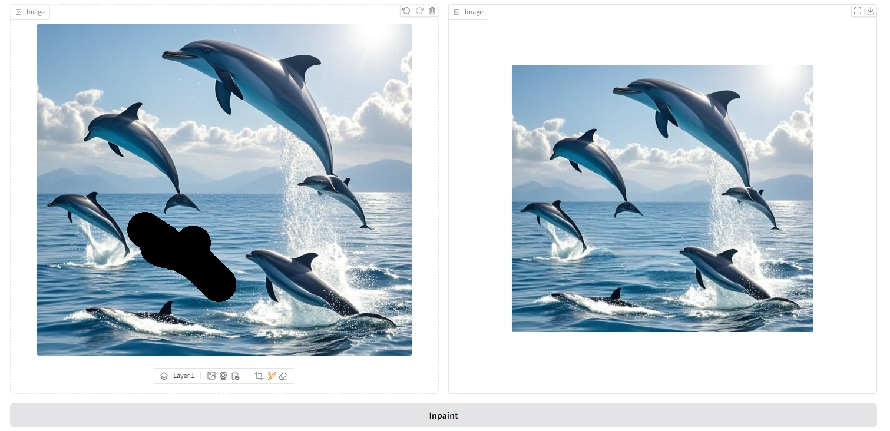

# usage
```
conda create -n inpaint python=3.10
conda activate 
pip install gradio==4.44.1
pip install opencv-python
pip install torchvision
```
When installing torchvision, torch will be installed automatically, so there is no need to install torch separately.
```
python .\app.py
```
output:
```
Running on local URL:  http://0.0.0.0:7860
```
Then open the URL in your browser.

Open test1.png, black out the swan, and then check the output.

Open test2.png, blacken a whale, and then check the output.
